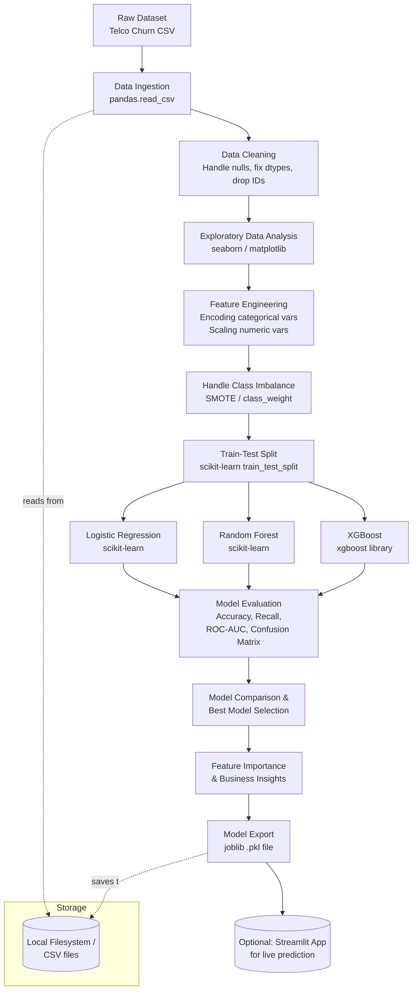

# Customer Churn Prediction

## 1. Project Description

This project predicts which customers are likely to stop using a service (churn) using historical customer data. The goal is to help a business proactively identify at-risk customers so retention teams can intervene before the customer leaves.

**Problem type:** Binary Classification (Churn = 1, No Churn = 0)

**Approach:**
1. Collect and clean a customer dataset (demographics, usage, billing, tenure, etc.)
2. Perform Exploratory Data Analysis (EDA) to understand churn patterns (e.g. which customer segments churn more, correlation between tenure/contract type/charges and churn)
3. Preprocess data (handle missing values, encode categorical variables, scale numeric features, handle class imbalance)
4. Train multiple classification models and compare performance
5. Evaluate models using metrics suited for imbalanced classification (not just accuracy)
6. Interpret results and extract business-actionable insights (e.g. "month-to-month contract customers churn 3x more")

**Dataset used:** Telco Customer Churn dataset (IBM/Kaggle) — ~7,000 customer records with features like tenure, contract type, monthly charges, internet service, payment method, and churn label.

---

## 2. Algorithms, Tools & Resources

### Algorithms / Models
| Model | Purpose |
|---|---|
| Logistic Regression | Baseline, interpretable linear model |
| Random Forest | Non-linear, handles feature interactions, gives feature importance |
| XGBoost | Gradient boosting, typically best performance on tabular data |

### Evaluation Metrics
- **Accuracy** – overall correctness (used cautiously due to class imbalance)
- **Recall** – how many actual churners we correctly catch (business-critical: missing a churner is costly)
- **Precision** – how many predicted churners are actually churners
- **ROC-AUC** – overall ability to separate churn vs non-churn classes across thresholds
- **Confusion Matrix** – breakdown of TP/FP/TN/FN

### Tech Stack / Libraries
| Category | Tool |
|---|---|
| Language | Python 3 |
| Data handling | pandas, numpy |
| Visualization | matplotlib, seaborn, plotly (optional) |
| ML Models | scikit-learn (Logistic Regression, Random Forest), xgboost |
| Class imbalance handling | imbalanced-learn (SMOTE) |
| Model persistence | joblib / pickle |
| Notebook environment | Jupyter Notebook / Google Colab |
| Optional deployment | Streamlit (for a simple churn prediction UI) |

### Resources
- Dataset: [Telco Customer Churn – Kaggle/IBM](https://www.kaggle.com/datasets/blastchar/telco-customer-churn)
- scikit-learn documentation
- XGBoost documentation
- imbalanced-learn documentation

---

## 3. Project Pipeline (Architecture)



**Notes on architecture:**
- No traditional database is used — data is stored and read as flat CSV files locally (or from Kaggle directly).
- No orchestrator (like Airflow) is needed since this is a single-run analytical/ML pipeline, not a recurring production pipeline. If productionized later, this pipeline could be wrapped in Airflow/Prefect for scheduled retraining.
- Entire pipeline is implemented in **Python**, primarily inside a Jupyter Notebook, with an optional Streamlit app as a lightweight serving layer for demoing predictions.

---

## 4. Project Structure (suggested)

```
churn-prediction/
│
├── data/
│   └── telco_churn.csv
├── notebooks/
│   └── churn_analysis.ipynb
├── src/
│   ├── preprocessing.py
│   ├── train_models.py
│   └── evaluate.py
├── models/
│   └── best_model.pkl
├── app/
│   └── streamlit_app.py   (optional)
├── README.md
└── TRACKER.md
```

## 5. How to Run
```bash
pip install pandas numpy scikit-learn xgboost imbalanced-learn matplotlib seaborn

jupyter notebook notebooks/churn_analysis.ipynb
```
